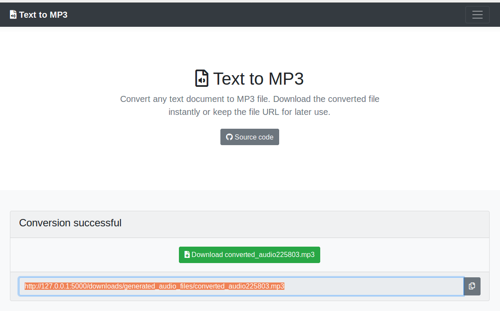

Text to MP3
===========

A web application for generating text to MP3 file. Convert any text document to MP3 file. Download the converted file instantly or keep the file URL for later use.

## Software Used

The following environment are used to develop the application:

- **OS** : Ubuntu 16.04 (64 bit)
- **IDE** : PyCharm Professional (Version: 2017.3)
- **Python** : 3.6.3 (64 bit)
- **Flask** : 1.0.2
- **gTTS** : 2.0.1
- **beautifulsoup4** : 4.6.0

### Packages installation and running the application (Linux / Mac)

- Create virtual environment and install required packages

		$ make install

- Activate virtual environment and run `app.py`

		$ make run

### Packages installation and running the application (Windows)

- Create virtual environment

		$ virtualenv venv -p python --no-site-packages

- Activate virtual environment

		$ venv\Scripts\activate.bat

- Install necessary packages included in `requirements.txt`

		$ pip install -r requirements.txt		

- Run the `app.py`

		$ python app.py

### URLS

- Web application URL: http://127.0.0.1:5000/

### Todo

- Add multiple voices support

- Enable text file upload option

- Add loader while the audio file is generating

### Contribute

Have time and enthusiasm to contribute in this project? Give a hand to accomplish the todo list. Make a pull request. We will appreciate your support. 
